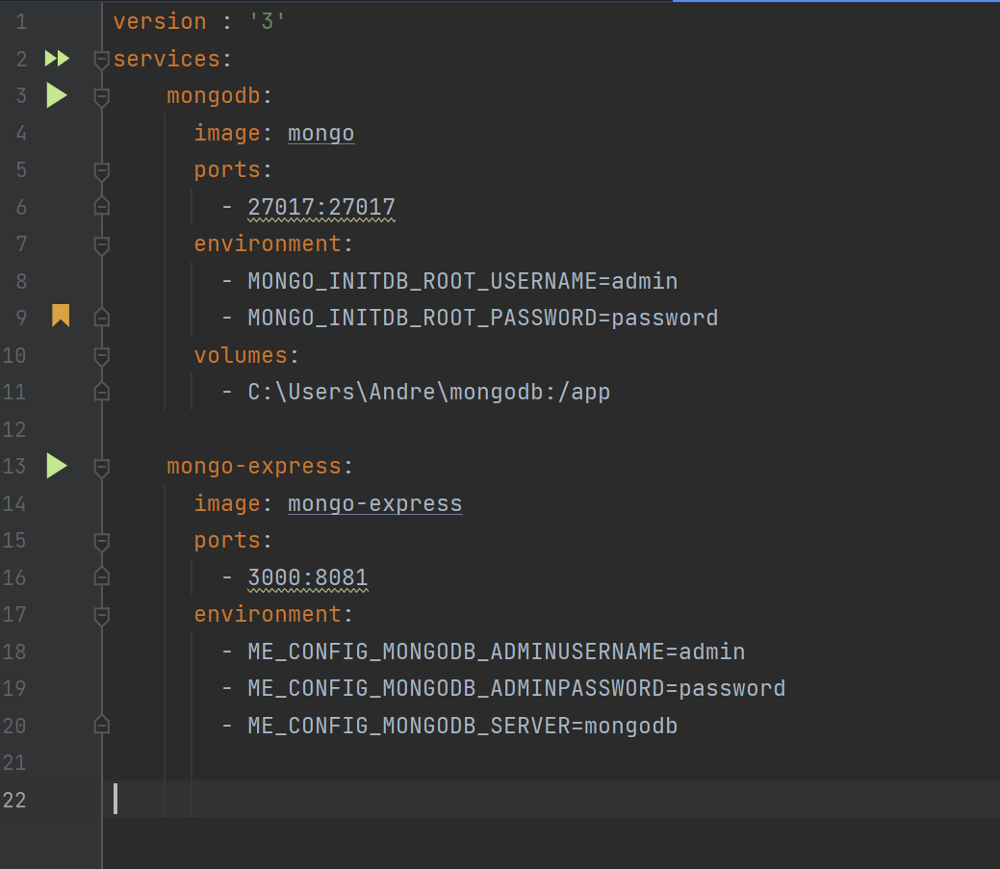

# Exercício 6

### Qual comando usamos para subir serviços de um compose file em segundo plano? E para encerrar tudo que foi criado através do compose file?

### Crie um arquivo .yml para subir 2 serviços com volumes persistentes, abertura de porta, nome de container e demais configurações que acharem pertinentes:

### Printe o conteúdo do arquivo.

Comando para subir serviço de um compose file em segundo plano:

```
docker-compose -f [arquivo.yaml] up -d
```

Comando para encerrar:

```
docker-compose -f [arquivo.yaml] down
```

